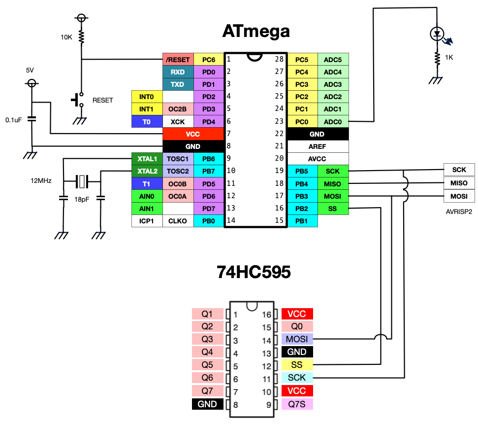

# SPI505

SPI出力をつかった74HC595のコントロール

* [spi595.h](../../include/spi595.h)
* [spi595.c](../../lib/spi595.c)

# 配線図

* ATmega48 TQFPを使用
* 74HC595の出力と電源は省略。出力は1KΩの抵抗を介してLEDをつけるとよい。
* 74HC595については[こちらも参照](https://github.com/mamemomonga/notebook-electronics/blob/master/Logics.md)
