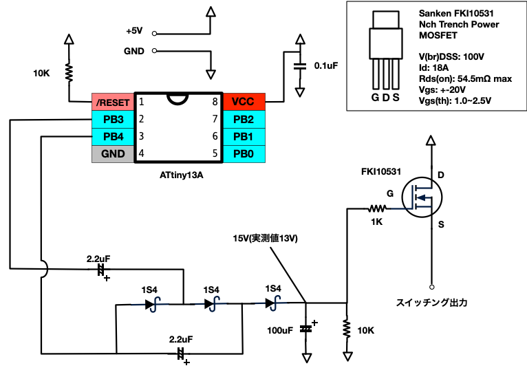

# Nch MOSFET ハイサイドスイッチング

* ATtiny13Aで64KHzの矩形波とその反転を生成、チャージポンプで15Vを生成してNch MOSFETをハイサイドスイッチング
* ゲートの実測値は14V。FKI10531のデータシートのグラフから、Vgsは4Vあれば完全にOnになるようなので、5V+4V=9Vあればよいとおもう。
* このプログラムでは、一定期間で間欠動作する。

# 回路図

# 参考

* [『昼夜逆転』工作室: ATtiny10使用 3倍圧チャージポンプモジュール](http://jsdiy.webcrow.jp/avr_tiny10_chargepump/)
* [epii's physics notes: チャージポンプ](https://www.epii.jp/articles/note/electronics/charge_pump)

