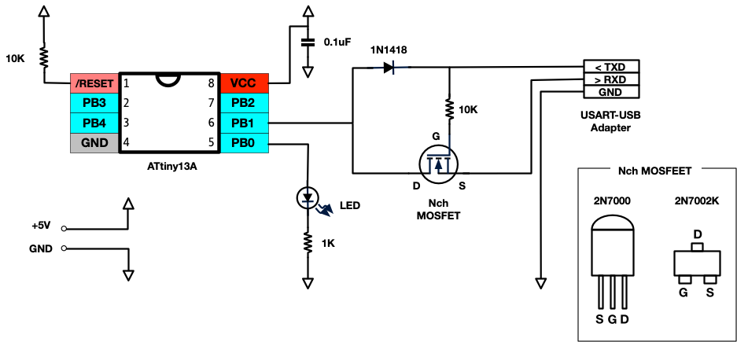

# ATtiny13Aによる半二重USART通信

* ATtiny13Aをつかった半二重通信
* INT0による入力割り込み
* OSCCALの簡易キャリブレーション

# 回路図

# PCとの接続

ここでは、CP2102をつかったUSB-UARTモジュールを使用する。

**ボーレートは 38400**

接続例(GNU screenを使用)

	$ screen /dev/cu.SLAB_USBtoUART 38400

## OSCCALの簡易キャリブレーション

内部RCオシレータは個体差が大きいため、OSCCALでキャリブレーションしないと入出力が不安定になる。

[list_osccal()](./main.c#L39) を利用すれば、シリアルに最適なOSCCAL値を出せる。

[23行目のコメント](./main.c#L23) を外して実行すると、文字化けデータに続いて正しく表示されるリストが表示される。その正しく表示されている範囲の中心あたりの値をOSCCALとして設定する。

	$ screen /dev/cu.SLAB_USBtoUART 38400

	--- 文字化け ---
	OSCCAL = 0x5d
	OSCCAL = 0x5e
	OSCCAL = 0x5f
	OSCCAL = 0x60
	OSCCAL = 0x61
	OSCCAL = 0x62
	OSCCAL = 0x63
	OSCCAL = 0x64
	--- 文字化け ---

この場合、0x60とか0x61を使用すればよい。

# 参考

* [AVR half-duplex software UART supporting single pin operation](http://nerdralph.blogspot.com/2014/01/avr-half-duplex-software-uart.html)
* [猫にコ・ン・バ・ン・ワ ATtiny13Aでシリアル通信(UART)を行う](http://nuneno.cocolog-nifty.com/blog/2014/11/attiny13aiuart-.html)

