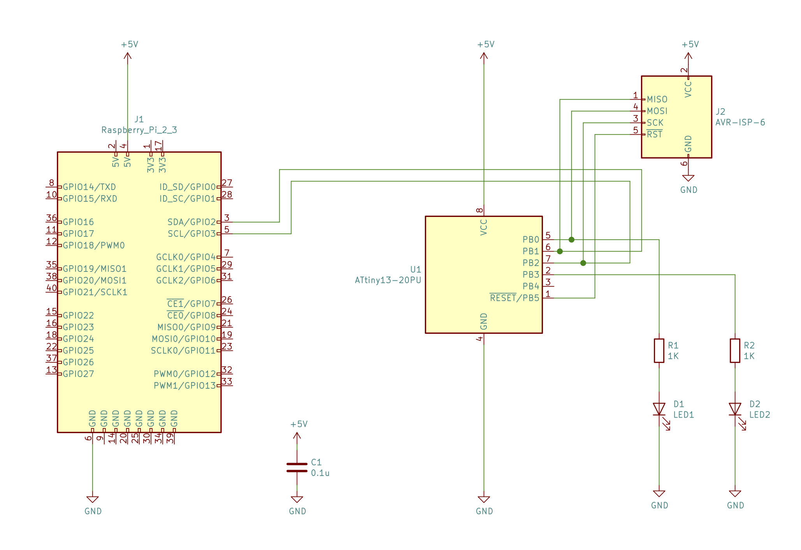

# i2c slave bitbang

ATTiny13Aに簡易的なi2c slaveにする

* 8ビットの送受信
* Raspberry Piからi2cdetect, i2cget, i2csetでコントロール
* データは i2c_datas[] を介して行われる。すべて読み書き可能
* i2c_data[]の配列はデータアドレスに対応している

メモリ使用状況

	AVR Memory Usage
	----------------
	Device: attiny13
	
	Program:     618 bytes (60.4% Full)
	(.text + .data + .bootloader)
	
	Data:         34 bytes (53.1% Full)
	(.data + .bss + .noinit)
	
簡単なデモコードで60.4%消費。

# ビルド

	$ make

# フューズビットの設定

	$ make fuse

# アップロード

	$ make flash

# 回路図

# 使用例

* Raspberry Pi(Raspbian)は事前にi2cを有効にしておき、i2c-toolsをインストールしておく。

## 実行例

デフォルトでは uint8_t i2c_datas[0x20] として 32バイトの領域が確保してある。

データアドレス | 内容
---------------|---------
0x01           | LEDを点滅させる
0x02           | 0x3d という値がデフォルトで入っている

デバイスアドレス(0x20)を発見する

	$ sudo i2cdetect -y 1
	     0  1  2  3  4  5  6  7  8  9  a  b  c  d  e  f
	00:          -- -- -- -- -- -- -- -- -- -- -- -- --
	10: -- -- -- -- -- -- -- -- -- -- -- -- -- -- -- --
	20: 20 -- -- -- -- -- -- -- -- -- -- -- -- -- -- --
	30: -- -- -- -- -- -- -- -- -- -- -- -- -- -- -- --
	40: -- -- -- -- -- -- -- -- -- -- -- -- -- -- -- --
	50: -- -- -- -- -- -- -- -- -- -- -- -- -- -- -- --
	60: -- -- -- -- -- -- -- -- -- -- -- -- -- -- -- --
	70: -- -- -- -- -- -- -- --

LED1を3回点滅させる

	$ sudo i2cset -y 1 0x20 0x01 3

LED1をさっき点滅させた回数を得る

	$ sudo i2cget -y 1 0x20 0x01 
	0x03

0x3dという値が入っているはずの0x02から値を取得する

	$ sudo i2cget -y 1 0x20 0x02

0x03の値を確認する

	$ sudo i2cget -y 1 0x20 0x03
	0x00

0x03に0x42をいれて、確認する。

	$ sudo i2cset -y 1 0x20 0x03 0x42
	$ sudo i2cget -y 1 0x20 0x03
	0x42

0x03に0xfdをいれて、確認する。

	$ sudo i2cset -y 1 0x20 0x03 0xfd
	$ sudo i2cget -y 1 0x20 0x03
	0xfd

たまに0x7dが帰ってくる・・・

