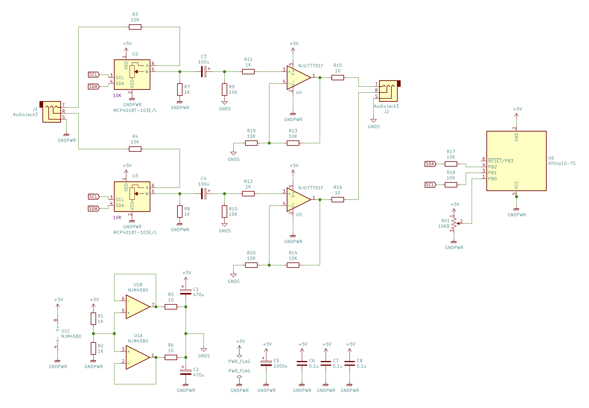

# ATTiny10 + MCP4018T-103E/LT + NJU77701Fで構成するヘッドホンアンプ

* MCP4017TをATTiny10からi2c-BitBangでコントロール
* 操作は通常の可変抵抗、ATTiny10のADCで読み取って、MCP4017Tをコントロールする
* NJM4580で1/2Vccを生成し、出力カップリングコンデンサレスにする

## 主要パーツ概要

### ATTiny10

米粒AVR

### MCP4018T-103E

i2cコントロールなデジタルポテンショメータ、128ステップ、最大10KΩ。最小は実測値で130Ωくらい。

### NJU77701F

1回路入り 34MHz 35V/us 低ノイズ 入出力フルスイング高速オペアンプ。600Ωフルスイングドライブ可能。動作電圧 2.4~5.5V

### NJM4580D

定番オペアンプ、仮想グランド電源生成用。

### 回路図

 [PDF](schematics/schematics.pdf)

### 注意点と問題点

* ヘッドホン出力(J2)のGNDは1/2Vccである。またここからヘッドホン以外の機器につなぐと問題が発生する恐れがある。
* MCP4018Tは小さいSO70-6パッケージ。SOT23-6パッケージよりピッチは狭く若干小さいが、変換基板にギリギリ半田付け可能
* NJU77701FはSOT23-5パッケージ
* NJU77701Fの推薦ゲインは5倍以上推薦、この回路は2倍になっている
* ボリューム変更時に小さなプチプチノイズが入る

### MCP4018Tへの入力

* MCP4018Tの抵抗器の電圧範囲はVdd-Vssである。Vddを越えると激しく歪む(クリップする)。
* Vssを下回っても歪まない？気付いてないだけ？
* 5V越えなくても歪む印象がある。（未計測）
* 抵抗の片側をVssに落としていないタイプだと、入力カップリングコンデンサを排除できる。
* 結局安全のために入力カップリングコンデンサはつけたほうがいいかもね。(DCが入るとヘッドホンを直撃する)

### 使用感

* NJU77701F + NJM4580D(電源)はとてもいい感じ、出力カップリングコンデンサレスにしているのもあってしっかりとした低音もでる。
* MCP4018Tを通しても音質がそれほど悪くなったようには思えない。ただ電源電圧を超えると一気に歪むので入力前にアッテネータが必要である。
* ヘッドホンアンプとして使うなら普通のボリュームつかったほうがいいですね。

